# VPN Site-to-Site IPSec IKEv2 (Route-Based)

**Estudiante:** Junior Javier Santos Perez
**Matrícula:** 2024-1599

---

## 1. Objetivo

El objetivo de esta práctica es configurar una **VPN Site-to-Site punto a punto basada en enrutamiento (route-based)**, utilizando el protocolo **IPSec con IKEv2** como mecanismo de intercambio de llaves y cifrado del tráfico entre dos sitios remotos.

Esta VPN permite que las redes LAN ubicadas detrás de los routers **R2** y **R3** se comuniquen de forma segura a través de una red pública (simulada por el router **R1**, que actúa como ISP/tránsito), cifrando todo el tráfico que viaja entre ambos sitios mediante un túnel GRE protegido con IPSec (interfaz `Tunnel10`).

A diferencia de una VPN basada en políticas (policy-based), el enfoque *route-based* utiliza una interfaz de túnel virtual sobre la cual se enruta el tráfico, lo que simplifica la administración de rutas y permite usar protocolos de enrutamiento dinámico si fuera necesario.

---

## 2. Topología de Red

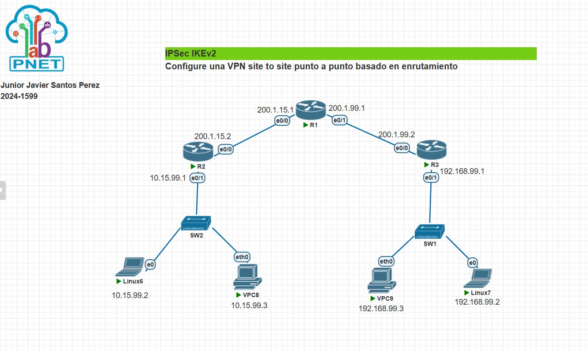
*IMAGEN1 — Topología general del escenario: R1 actúa como ISP/tránsito entre los dos sitios; R2 y R3 son los routers VPN; cada uno tiene una LAN local conectada mediante un switch a un PC virtual (VPC) y una máquina Linux.*

### 2.1 Direccionamiento IP

| Dispositivo | Interfaz | Dirección IP | Descripción |
|---|---|---|---|
| R1 (ISP) | e0/0 | 200.1.15.1/24 | Enlace hacia R2 |
| R1 (ISP) | e0/1 | 200.1.99.1/24 | Enlace hacia R3 |
| R2 | e0/0 (WAN) | 200.1.15.2/24 | Enlace hacia R1 / Internet |
| R2 | e0/1 (LAN) | 10.15.99.1/24 | Red local de Sitio A |
| R2 | Tunnel10 | 172.16.1.1/30 | Interfaz virtual del túnel VPN |
| R3 | e0/0 (WAN) | 200.1.99.2/24 | Enlace hacia R1 / Internet |
| R3 | e0/1 (LAN) | 192.168.99.1/24 | Red local de Sitio B |
| R3 | Tunnel10 | 172.16.1.2/30 | Interfaz virtual del túnel VPN |
| SW2 | — | — | Switch de la LAN de Sitio A (conecta a Linux6 y VPC8) |
| Linux6 | eth/e0 | 10.15.99.2/24 | Host final Sitio A |
| VPC8 | eth0 | 10.15.99.3/24 | Host final Sitio A |
| SW1 | — | — | Switch de la LAN de Sitio B (conecta a VPC9 y Linux7) |
| VPC9 | eth0 | 192.168.99.3/24 | Host final Sitio B |
| Linux7 | eth/e0 | 192.168.99.2/24 | Host final Sitio B |

No se utilizaron VLANs en este escenario; cada switch maneja una única red plana por sitio.

### 2.2 Resumen de roles

- **R1:** simula el proveedor de Internet (ISP). Solo enruta el tráfico entre las dos WAN públicas, sin tener conocimiento del túnel VPN.
- **R2:** router VPN del Sitio A (LAN 10.15.99.0/24). Origina el túnel `Tunnel10` hacia R3.
- **R3:** router VPN del Sitio B (LAN 192.168.99.0/24). Origina el túnel `Tunnel10` hacia R2.

---

## 3. Configuración de R1 (ISP)

R1 únicamente provee conectividad IP entre las dos redes WAN públicas (200.1.15.0/24 y 200.1.99.0/24). No participa en la negociación IPSec ni conoce la existencia del túnel; simplemente reenvía paquetes IP entre sus dos interfaces.

```
interface e0/0
 ip address 200.1.15.1 255.255.255.0
 no shutdown

interface e0/1
 ip address 200.1.99.1 255.255.255.0
 no shutdown
```

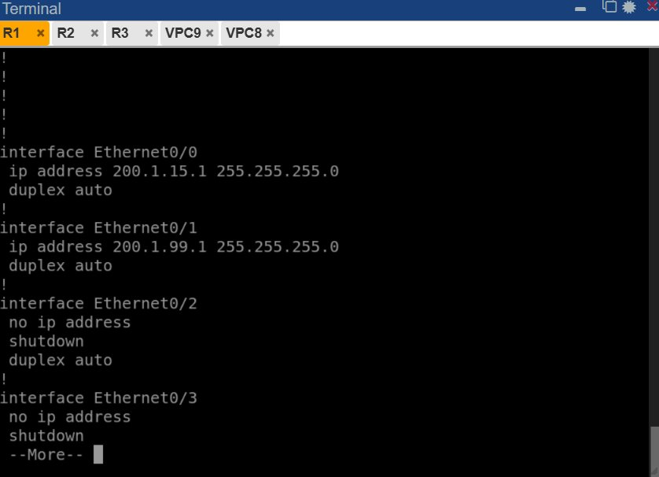
*IMAGEN2 — Verificación de las interfaces Ethernet0/0 y Ethernet0/1 de R1, mostrando las direcciones IP 200.1.15.1/24 y 200.1.99.1/24 correspondientes a cada enlace hacia R2 y R3 respectivamente.*

---

## 4. Configuración de R2 (Sitio A)

### 4.1 Interfaces y túnel

```
hostname R2

interface e0/0
 ip address 200.1.15.2 255.255.255.0
 no shutdown

interface e0/1
 ip address 10.15.99.1 255.255.255.0
 no shutdown

ip route 0.0.0.0 0.0.0.0 200.1.15.1

interface Tunnel10
 ip address 172.16.1.1 255.255.255.252
 tunnel source 200.1.15.2
 tunnel destination 200.1.99.2
 tunnel mode ipsec ipv4
 tunnel protection ipsec profile VPN-PROFILE

ip route 192.168.99.0 255.255.255.0 Tunnel10
```

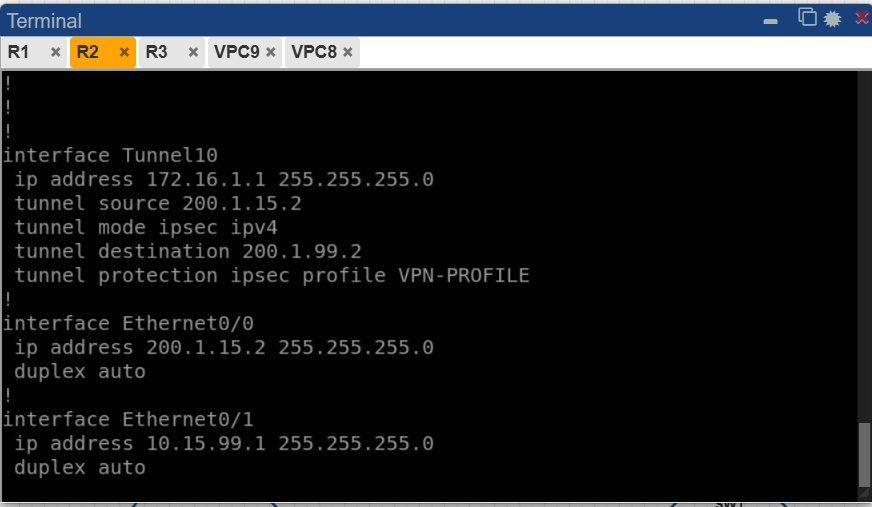
*IMAGEN3 — Configuración de la interfaz `Tunnel10` en R2: dirección IP 172.16.1.1/30, origen del túnel 200.1.15.2 (su propia WAN), destino 200.1.99.2 (WAN de R3), modo `ipsec ipv4` y protección mediante el perfil IPSec `VPN-PROFILE`. También se observan las interfaces físicas e0/0 (WAN) y e0/1 (LAN).*

### 4.2 Parámetros IKEv2 e IPSec configurados

```
crypto ikev2 proposal IKEV2-PROP
 encryption aes-cbc-256
 integrity sha256
 group 14

crypto ikev2 policy IKEV2-POLICY
 proposal IKEV2-PROP

crypto ikev2 keyring VPN-KEYRING
 peer R3
  address 200.1.99.2
  pre-shared-key cisco

crypto ikev2 profile IKEV2-PROFILE
 match identity remote address 200.1.99.2 255.255.255.255
 authentication local pre-share
 authentication remote pre-share
 keyring local VPN-KEYRING

crypto ipsec transform-set VPN-SET esp-aes 256 esp-sha256-hmac
 mode tunnel

crypto ipsec profile VPN-PROFILE
 set transform-set VPN-SET
 set ikev2-profile IKEV2-PROFILE
```

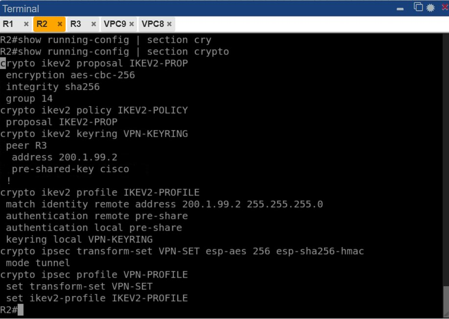
*IMAGEN7 — Salida del comando `show running-config | section crypto` en R2, donde se observa toda la cadena de configuración: la propuesta IKEv2 (`IKEV2-PROP`), la política IKEv2 (`IKEV2-POLICY`), el keyring con la llave precompartida (`pre-shared-key cisco`) hacia R3, el perfil IKEv2 (`IKEV2-PROFILE`), el transform-set IPSec (`VPN-SET`) y el perfil IPSec (`VPN-PROFILE`) que protege el túnel.*

### 4.3 Verificación del túnel en R2

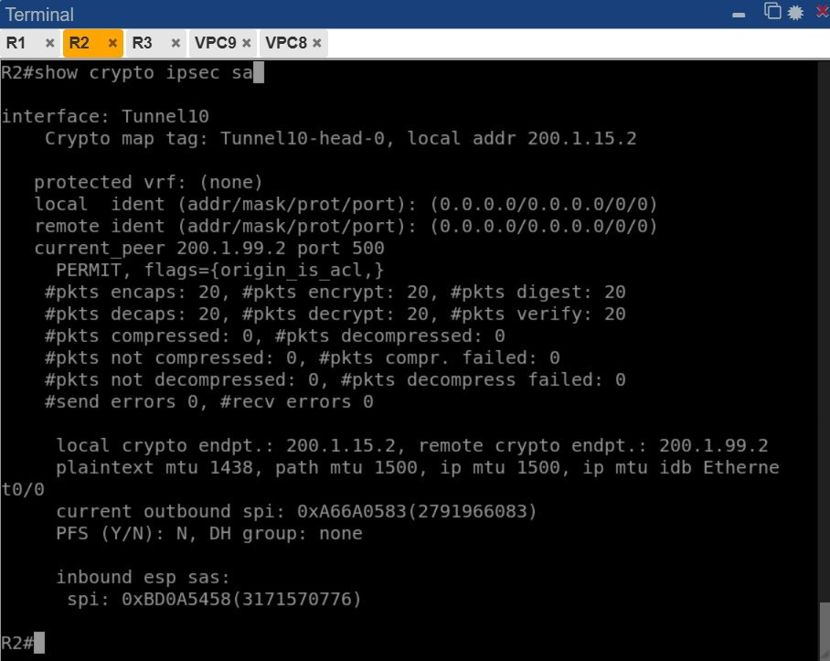
*IMAGEN4 — Salida de `show crypto ipsec sa` en R2: se confirma el peer remoto 200.1.99.2 en el puerto 500, con 20 paquetes encapsulados/encriptados y 20 desencapsulados/desencriptados sin errores de envío ni recepción, lo que indica que el túnel está transmitiendo tráfico correctamente en ambas direcciones.*

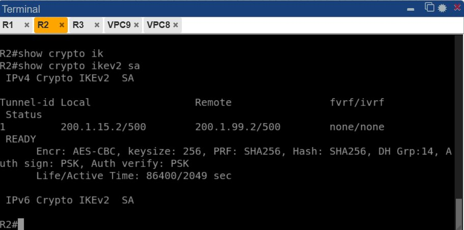
*IMAGEN5 — Salida de `show crypto ikev2 sa` en R2: la sesión hacia 200.1.99.2 está en estado `READY`, usando cifrado AES-CBC de 256 bits, PRF y Hash SHA256, grupo Diffie-Hellman 14 y autenticación mediante PSK (pre-shared key) tanto local como remota.*

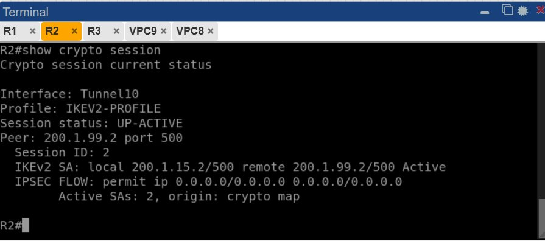
*IMAGEN6 — Salida de `show crypto session` en R2: confirma que la interfaz `Tunnel10`, usando el perfil `IKEV2-PROFILE`, tiene el estado de sesión `UP-ACTIVE` con el peer 200.1.99.2, y 2 SAs activas para el flujo IPSec.*

---

## 5. Configuración de R3 (Sitio B)

### 5.1 Interfaces y túnel

```
hostname R3

interface e0/0
 ip address 200.1.99.2 255.255.255.0
 no shutdown

interface e0/1
 ip address 192.168.99.1 255.255.255.0
 no shutdown

ip route 0.0.0.0 0.0.0.0 200.1.99.1

interface Tunnel10
 ip address 172.16.1.2 255.255.255.252
 tunnel source 200.1.99.2
 tunnel destination 200.1.15.2
 tunnel mode ipsec ipv4
 tunnel protection ipsec profile VPN-PROFILE

ip route 10.15.99.0 255.255.255.0 Tunnel10
```

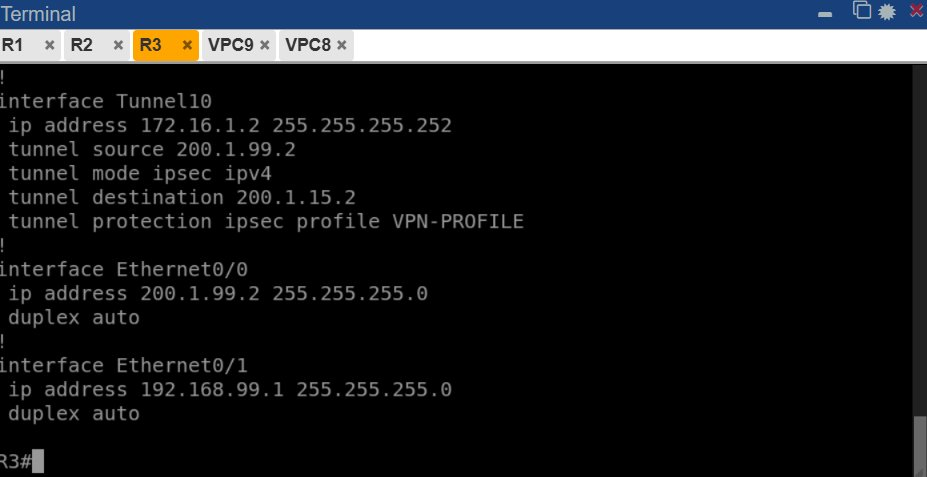
*IMAGEN8 — Configuración de la interfaz `Tunnel10` en R3: dirección IP 172.16.1.2/30, origen del túnel 200.1.99.2 (su propia WAN), destino 200.1.15.2 (WAN de R2), modo `ipsec ipv4` y protección mediante el perfil `VPN-PROFILE`. También se observan las interfaces físicas e0/0 (WAN) y e0/1 (LAN).*

### 5.2 Parámetros IKEv2 e IPSec configurados

```
crypto ikev2 proposal IKEV2-PROP
 encryption aes-cbc-256
 integrity sha256
 group 14

crypto ikev2 policy IKEV2-POLICY
 proposal IKEV2-PROP

crypto ikev2 keyring VPN-KEYRING
 peer R2
  address 200.1.15.2
  pre-shared-key cisco

crypto ikev2 profile IKEV2-PROFILE
 match identity remote address 200.1.15.2 255.255.255.255
 authentication local pre-share
 authentication remote pre-share
 keyring local VPN-KEYRING

crypto ipsec transform-set VPN-SET esp-aes 256 esp-sha256-hmac
 mode tunnel

crypto ipsec profile VPN-PROFILE
 set transform-set VPN-SET
 set ikev2-profile IKEV2-PROFILE
```

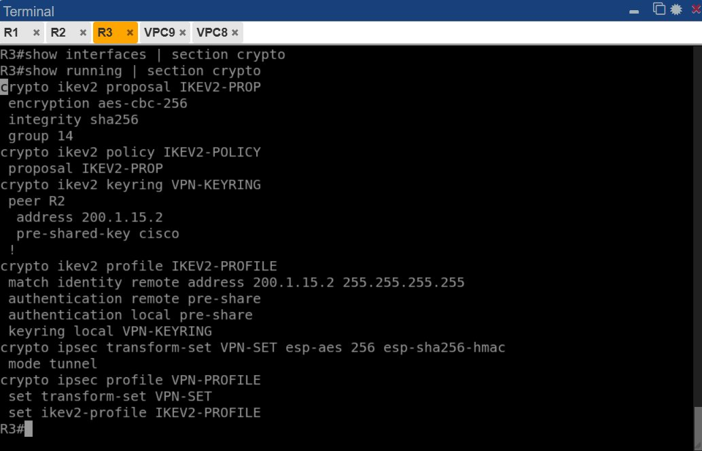
*IMAGEN12 — Salida de `show running-config | section crypto` en R3, mostrando la configuración simétrica a la de R2: la misma propuesta y política IKEv2, el keyring con el peer apuntando a R2 (200.1.15.2) y la misma llave precompartida, el perfil IKEv2, el transform-set y el perfil IPSec que protege el túnel.*

### 5.3 Verificación del túnel en R3

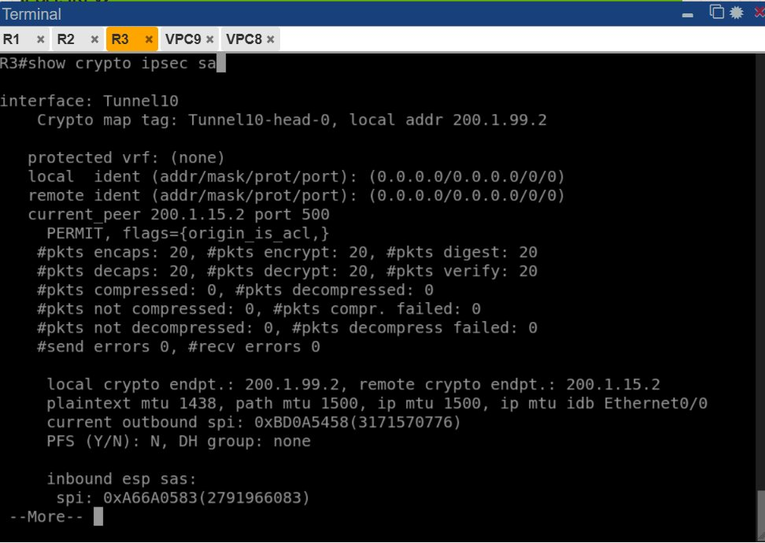
*IMAGEN9 — Salida de `show crypto ipsec sa` en R3: confirma el peer remoto 200.1.15.2 en el puerto 500, con 20 paquetes encapsulados/encriptados y 20 desencapsulados/desencriptados sin errores, valor simétrico al observado en R2, lo que valida que el tráfico fluye correctamente en ambos sentidos del túnel.*

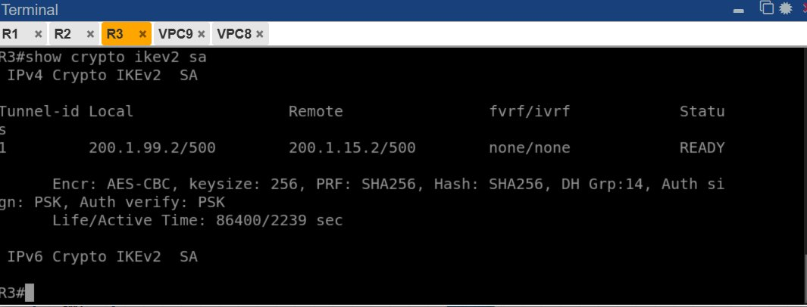
*IMAGEN10 — Salida de `show crypto ikev2 sa` en R3: sesión hacia 200.1.15.2 en estado `READY`, con los mismos parámetros criptográficos negociados (AES-CBC 256, SHA256, grupo DH 14, autenticación PSK), confirmando que ambos extremos del túnel acordaron exitosamente los mismos parámetros de seguridad.*

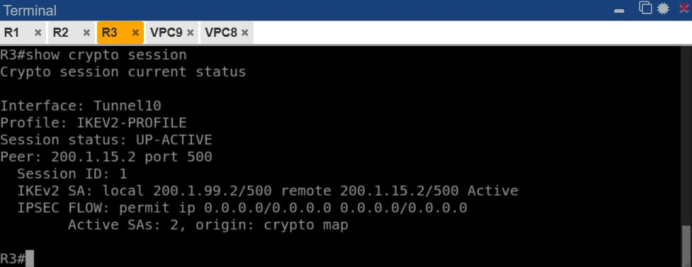
*IMAGEN11 — Salida de `show crypto session` en R3: la interfaz `Tunnel10` con el perfil `IKEV2-PROFILE` muestra el estado `UP-ACTIVE` hacia el peer 200.1.15.2, con 2 SAs activas, confirmando que el túnel está completamente establecido desde ambos extremos.*

---

## 6. Pruebas de Conectividad End-to-End

Para validar que el túnel VPN cifra y permite efectivamente el tráfico entre las LANs remotas, se realizaron pruebas de ping cruzadas entre los hosts finales de cada sitio.

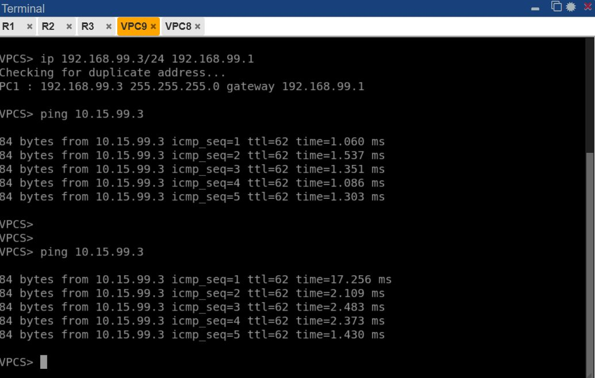
*IMAGEN13 — Desde VPC9 (192.168.99.3, Sitio B) se asigna su IP/gateway y se hace ping exitoso hacia 10.15.99.3 (VPC8, Sitio A). Las respuestas confirman 0% de pérdida de paquetes, validando que el tráfico atraviesa el túnel `Tunnel10` cifrado entre R3 y R2 y llega correctamente a la LAN remota.*

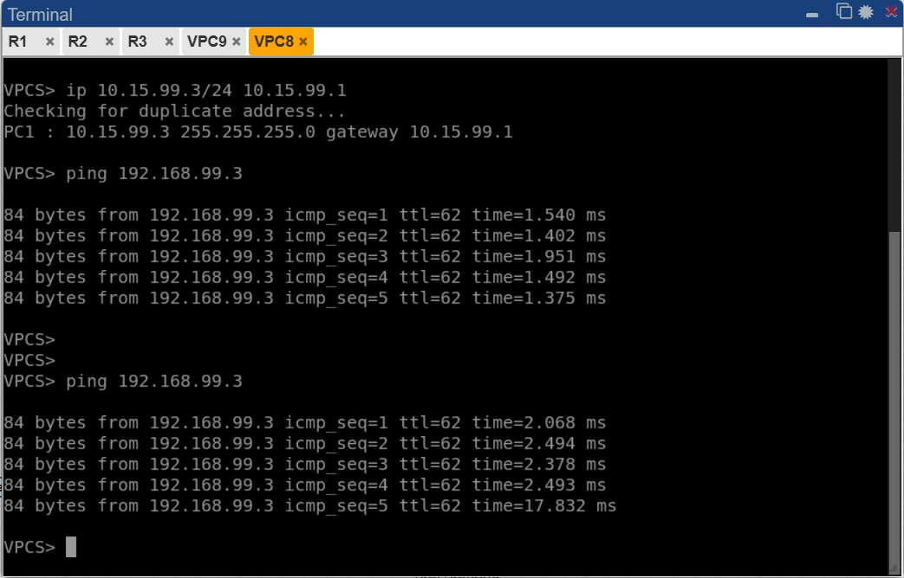
*IMAGEN14 — Desde VPC8 (10.15.99.3, Sitio A) se asigna su IP/gateway y se hace ping exitoso hacia 192.168.99.3 (VPC9, Sitio B). Igualmente se obtiene 0% de pérdida, confirmando la bidireccionalidad del túnel VPN y que el enrutamiento (`ip route` hacia `Tunnel10` en ambos routers) funciona correctamente en ambas direcciones.*

---

## 7. Resumen de Parámetros Utilizados

| Parámetro | Valor |
|---|---|
| Protocolo de intercambio de llaves | IKEv2 |
| Modo IPSec | Tunnel |
| Algoritmo de cifrado | AES-CBC 256 bits |
| Algoritmo de integridad | SHA-256 |
| Grupo Diffie-Hellman | Grupo 14 |
| Método de autenticación | Pre-Shared Key (PSK) — `cisco` |
| Transform-set | esp-aes 256, esp-sha256-hmac |
| Interfaz de túnel | Tunnel10 (GRE sobre IPSec, `tunnel mode ipsec ipv4`) |
| Red del túnel | 172.16.1.0/30 |
| Tiempo de vida de la SA (Lifetime) | 86400 segundos |

---

## 8. Conclusión

Se logró establecer exitosamente una VPN Site-to-Site basada en enrutamiento utilizando IPSec con IKEv2 entre los routers R2 y R3, protegiendo el tráfico mediante AES-256 y SHA-256, con autenticación por llave precompartida y negociación bajo el grupo Diffie-Hellman 14. Las verificaciones de estado (`show crypto ikev2 sa`, `show crypto ipsec sa`, `show crypto session`) confirmaron en ambos extremos que el túnel quedó en estado `UP-ACTIVE` y `READY`, y las pruebas de ping extremo a extremo entre las LANs de ambos sitios validaron que el tráfico de datos viaja cifrado y sin pérdidas a través del túnel `Tunnel10`.
